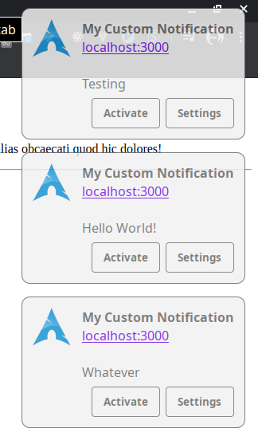

# Screenshot


# Commands

```shell
npx web-push generate-vapid-keys
```

# More Resources

- [Web Notifications](https://developers.google.com/web/fundamentals/codelabs/push-notifications)
- [Notification Generator](https://tests.peter.sh/notification-generator/#title=2;;dir=1)
- [Service Worker Introduction](https://developers.google.com/web/fundamentals/primers/service-workers?hl=es)
- [Why My Service Worker Data is null?](https://stackoverflow.com/questions/42375352/why-is-my-service-workers-push-event-data-payload-null)